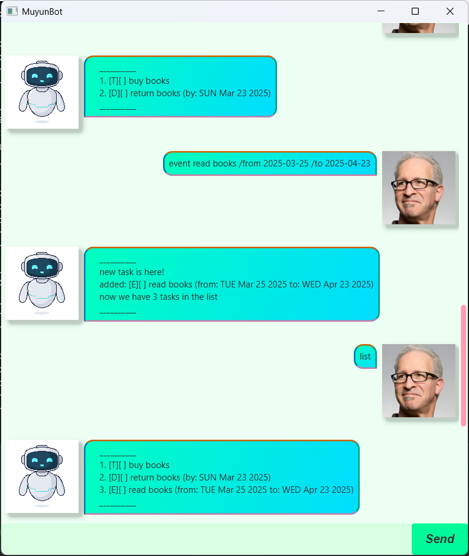

# MuyunBot User Guide
A personal **desktop planner** that helps you to keep track of daily tasks!



## Quick Start
1. Ensure you have java 17 installed.
2. Download the latest .jar file from [here](https://github.com/SAN-MUYUN/ip/releases/tag/A-UserGuide)
3. Copy the file to the folder you want to use as the home folder for your app.
4. Open a command terminal, ```cd``` into the folder you put the jar file in. 
5. Run ```java -jar MuyunBot.jar``` command to run the application.

## Add Todos

- Add a simple todo Task to the list

- command: ```todo <task description>```

Example: `todo borrow books`

exptected output:
```
___________
new task is here!
added [T][] borrow books
now we have 1 task in the list!
___________
```

## Add Deadline

- Add a task with a deadline
- command: ```deadline <description> /by <deadline>```

example: ```deadline return books /by 2025-03-01```


## Add Event
- Add an event task with a start time and end time
- command: ```event <description> / from <start time> /to <end time>```

example: ```event read books /from 2025-03-01 /to 2025-04-01```

*Note that for time input, follow the format: YYYY-MM-DD*

## Delete
- delete a particular task from the list
- command: ```delete <index of task>```

example: ```delete 2```

this will delete the second task from the list.

## List
- list out all content in the list
- command: ```list```

## Find
- search for a task with description containing the keyword
- command: ```find <keyword>```

example: ```find books```

result:
```
    __________
    4. [T][ ] borrow books
    5. [D][ ] return books (by: SAT Mar 1 2025)
    6. [E][ ] read books (from: SAT Mar 1 2025 to: TUE Apr 1 2025)
    __________
```

## Update:
- update the description or time (if applicable) of a task with index x
- command: ```update <x> <new description>```
- update of component of choice, not necessarily update the entire task

example:
- to update the description of task 4
  - ```update 4 test```
- to update a deadline of task 5
  - ```update 5 /by 2025-05-12```
- to update the description and start time of task 6
  - ```update 6 read some books /from 2025-02-25```
  - result: 
  ```
    __________
    updated:
    [E][ ] read something (from: THU Feb 27 2025 to: TUE Apr 1 2025)
    __________
  ```
## Exiting the program: ```bye```
- exits from the program

## Saving the data:
MuyunBot saves the data automatically in a local file automatically after any command that changes the data. 
There is no need to save manually.
